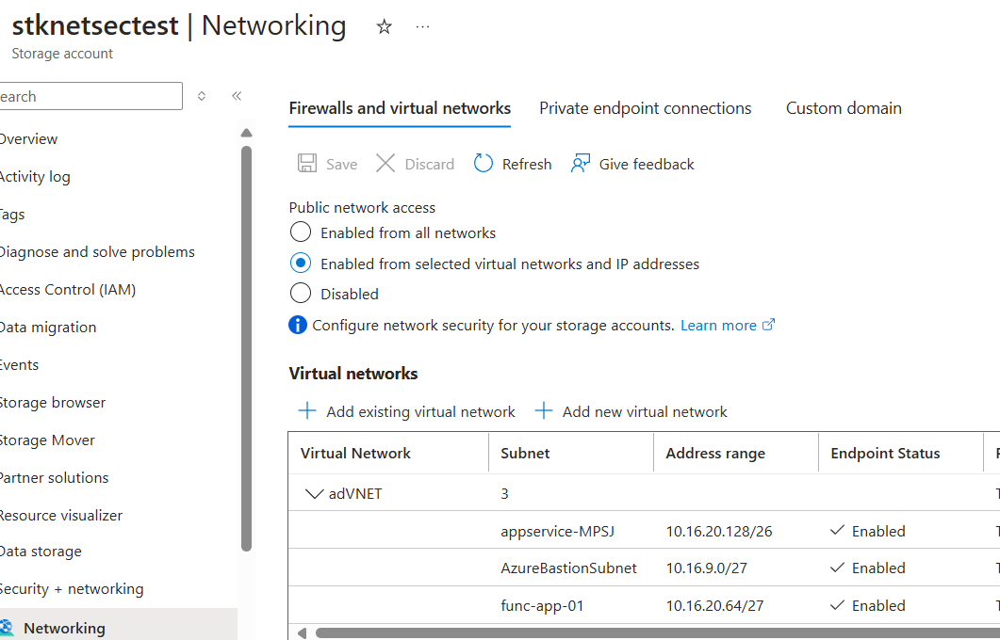
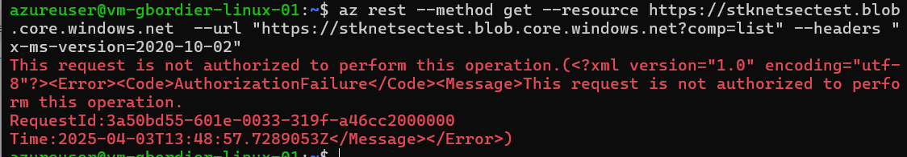
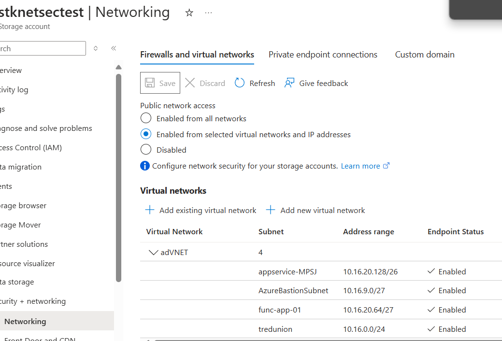
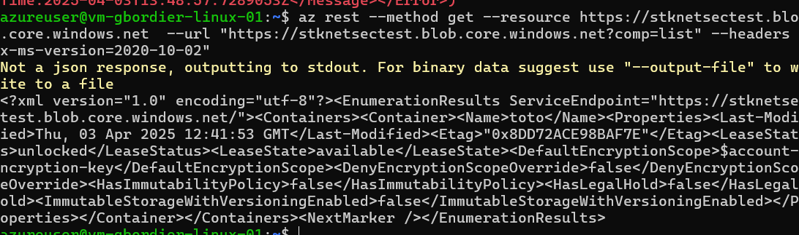
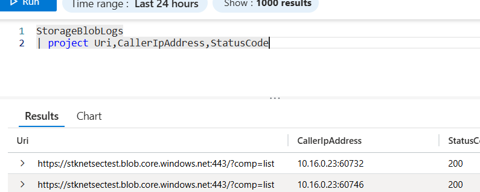
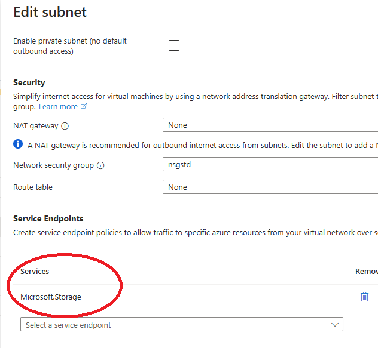
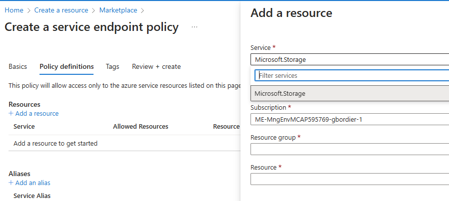

# Going Private : Understanding service endpoints, private endpoints and looking up to security perimeters.

So my dev team has come up with this nice PAAS based application with a whole lot of components talking to each other.

the Security guy first reflex might be : **"everything has to go inside one of our vnets for security to approve this"**

While this is to be expected this is not necessary always the smartest move: 

## Private endpoints

Private endpoint are essentially network interface in a vnet for your PAAS resource to receive traffic from private ip addresses that will be routed through your network and seen on any firewall on the way providing you understand how it [works](https://blog.cloudtrooper.net/category/privatelink/privatelinkrealitybites/)  see this extensive explanation from my collegue. 

Private endpoints requires:

- private dns zones to exist, be resolvable by whoever need them, 

- private dns zones will probably be centrally manage with your devops team not having access because of segregation of duty considerations

- normally the cloud foundation team would have created those and setup azure policies to automatically create DNS records, but sometimes ... 

- the networking component of private endpoints can be hard to understand (route injection in adjacent vnets ?? )

  ... and private endpoints come at additional cost.

Because of all this deploying those assets might be difficult, we will need to wait for DNS records to be created for further operations on protected resource to occur which mean

- deployment might require several stages or but put asleep until the DNS shows up
- unit testing can only happens after those resources are created

### Private endpoint network policies
Again extremely well explained in cloudtrooper article, but here is the short version.
Private endpoint policies come in two forms which can be enabled at the subnet level:
[enabling private endpoint network policies](https://learn.microsoft.com/en-us/azure/private-link/disable-private-endpoint-network-policy?tabs=network-policy-portal#enable-network-policy)

#### routing policies
routing policies will override the automatic routing injection of azure into adjacent vnet.
What does it mean ? 

The /32 route that is injected into your network **and peered vnets** and is the cause for so many misunderstandings will not be published if you managed those route yourself.

#### security policies
 allow your NSG in your subnet to apply to private endpoint **by default they do not** 
why ? good question

## Service Endpoints

Service endpoint are available for most paas resources (blob , ..)

They allow to whitelist specific VNET/subnets within your subscription / tenant to access a specific resources. 

**service endpoint allow resources to "automagically" connect from their private IP address into public facing resources**  

#### testing service endpoints

storage account allows to whitelist subnets:

My VM is on the "tredunion" subnet not listed here ==> KO

If I add the "tredunion" subnet to the whitelist:

Now the subnet is whitelisted => OK

*note that the actual ip address is the private IP anyway*

### service endpoint requirements

Whitelisted subnets require a "door" to be opened from the subnet to the specific resource type.

### is service endpoint the perfect solution ?

Well, it depends, service endpoint allows a vnet integrated workload to go "out" to a specific type of resources without restriction on the resource or the tenant it is located in, which also mean we are getting into all sort of **data leakage scenarios**, so depending how much we trust the code running on outgoing workloads it might be a good or a terrible idea.

#### Service endpoint policies
To remediate this we have a first level solution : service endpoint policies that allow us to specify exactely which resource we should allow access to. 

however they only exist for ... storage accounts.

so **yes service endpoint are a great security solution for ... storage accounts only** , they are secure, cheap and easy to deploy.

### Next stage  : Azure Security Perimeters

Azure security Perimeters are well explained in several places such as [What is a network security perimeter? - Azure Private Link | Microsoft Learn](https://learn.microsoft.com/en-us/azure/private-link/network-security-perimeter-concepts)

basically , they allow you to create a **set** of public facing pass ressources and define inbound and outbound rules to access :

Them they are really great but apply only to: https://learn.microsoft.com/en-us/azure/private-link/network-security-perimeter-concepts#onboarded-private-link-resources 

| Private link resource name                                   | Resource type                                                | Resources                                                    |
| :----------------------------------------------------------- | :----------------------------------------------------------- | :----------------------------------------------------------- |
| [Azure Monitor](https://learn.microsoft.com/en-us/azure/azure-monitor/essentials/network-security-perimeter) | Microsoft.Insights/dataCollectionEndpoints Microsoft.Insights/ScheduledQueryRules Microsoft.Insights/actionGroups Microsoft.OperationalInsights/workspaces | Log Analytics Workspace, Application Insights, Alerts, Notification Service |
| [Azure AI Search](https://learn.microsoft.com/en-us/azure/search/search-security-network-security-perimiter) | Microsoft.Search/searchServices                              | -                                                            |
| [Cosmos DB](https://learn.microsoft.com/en-us/azure/cosmos-db/how-to-configure-nsp) | Microsoft.DocumentDB/databaseAccounts                        | -                                                            |
| [Event Hubs](https://learn.microsoft.com/en-us/azure/event-hubs/network-security-perimeter) | Microsoft.EventHub/namespaces                                | -                                                            |
| [Key Vault](https://learn.microsoft.com/en-us/azure/key-vault/general/network-security#network-security-perimeter-preview) | Microsoft.KeyVault/vaults                                    | -                                                            |
| [SQL DB](https://learn.microsoft.com/en-us/azure/azure-sql/database/network-security-perimeter) | Microsoft.Sql/servers                                        | -                                                            |
| [Storage](https://learn.microsoft.com/en-us/azure/storage/common/storage-network-security#network-secuirty-perimeter-preview) | Microsoft.Storage/storageAccounts                            | -                                                            |

As always this short summary does not compare to Cloudtrooper's [[privatelinkrealitybites – Cloudtrooper](https://blog.cloudtrooper.net/category/privatelink/privatelinkrealitybites/)](https://blog.cloudtrooper.net/category/privatelink/privatelinkrealitybites/) on this but hopefully was faster to read. 